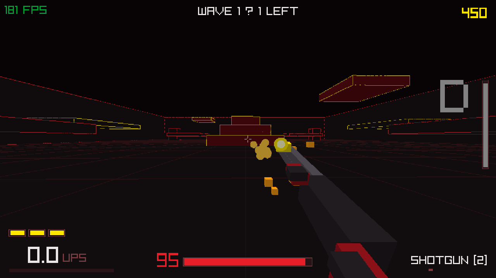
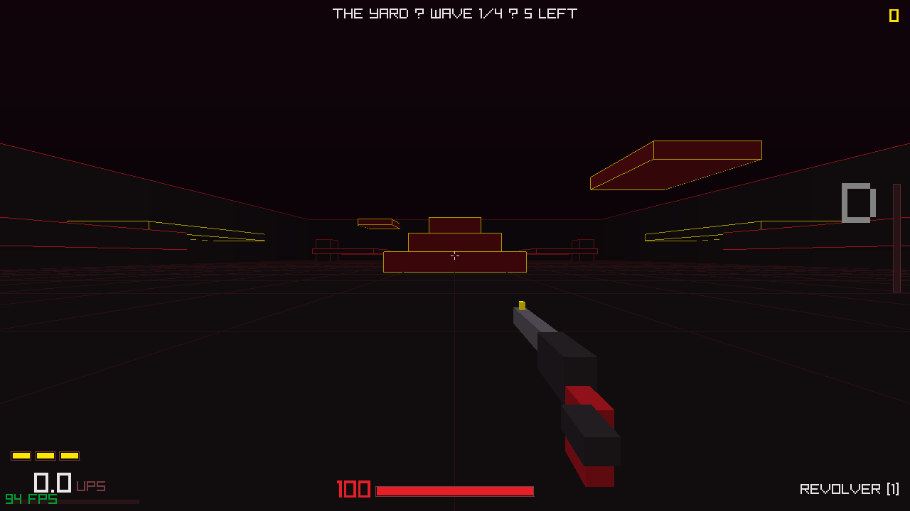
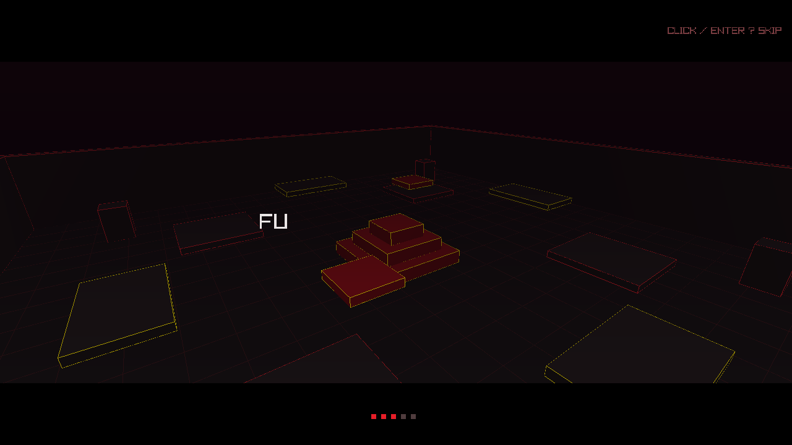

# BLOODRUSH

[](https://github.com/shidikusik/Fps/actions/workflows/flatpak.yml)
[](https://github.com/shidikusik/Fps/actions/workflows/builds.yml)

**[English](README.md) | Русский**

Безумный fast-paced арена-шутер от первого лица в духе ULTRAKILL.
C++20 + raylib, ретро low-poly, рендер 720p с пиксельным апскейлом,
полностью процедурный звук — ни одного файла ассетов.
Bunny hop, dash, slide, ground slam, стайл-метр и лечение кровью.
**3 уровня, сюжетные катсцены, 4 оружия, босс THE WARDEN и бесконечный
NG+ цикл после победы.**

Работает на **Linux** (X11 и Wayland), **Windows** и **Android**.



|  |  |
|---|---|
| THE YARD, первая волна | вступительная катсцена |

## Сюжет

Земля мертва. Боевая машина V-13 просыпается с пустыми баками —
и находит альтернативное топливо: кровь. Башня зовёт вниз, слой за слоем:

1. **THE YARD** — открытый двор со ступенчатой башней.
2. **THE CATACOMBS** — лабиринт колонн и надземных мостиков.
3. **THE ALTAR** — вертикальный шпиль, на вершине которого ждёт
   **THE WARDEN**.

Каждый слой — 4 волны, третий заканчивается боссом. Убей Хранителя —
и башня предложит только одно: глубже. LOOP 2. LOOP 3...

## Готовые сборки (артефакты CI)

CI собирает пакеты на каждый пуш: вкладка
[**Actions**](https://github.com/shidikusik/Fps/actions) → последний
зелёный запуск (артефакты приходят zip-архивами, нужен вход в GitHub):

| Платформа | Workflow | Артефакт |
|---|---|---|
| Linux (Flatpak) | Flatpak | `bloodrush-x86_64.flatpak` |
| Windows 10/11 x64 | Builds | `bloodrush-windows-x86_64` (`bloodrush.exe`) |
| Android 7.0+ (arm64) | Builds | `bloodrush-android` (`bloodrush.apk`) |

- **Linux**: `flatpak install --user bloodrush-x86_64.flatpak` — игра
  появится в меню приложений с иконкой.
- **Windows**: распаковать и запустить `bloodrush.exe` — полностью
  автономный, без зависимостей.
- **Android**: установить APK (разрешите «неизвестные источники»;
  подписан debug-ключом). Тач-управление: левая половина — стик
  движения, правая — обзор, экранные кнопки: огонь/прыжок/dash/
  slide/смена оружия.

Локальная сборка Flatpak и инструкция по публикации на Flathub —
в [packaging/flatpak/](packaging/flatpak/).

## Установка на любом дистрибутиве Linux

Нужны только: **компилятор C++ (GCC/Clang), CMake ≥ 3.16 и git**.
raylib ставить не обязательно — если его нет в системе, CMake сам
скачает и соберёт raylib 5.5 внутри проекта.

### 1. Зависимости

**Arch / Manjaro / EndeavourOS:**
```sh
sudo pacman -S --needed base-devel cmake git raylib
```

**Ubuntu / Debian / Mint / Pop!_OS:**
```sh
sudo apt update
sudo apt install -y build-essential cmake git \
    libgl1-mesa-dev libx11-dev libxrandr-dev libxinerama-dev \
    libxcursor-dev libxi-dev libwayland-dev libxkbcommon-dev wayland-protocols
```

**Fedora / Nobara:**
```sh
sudo dnf install -y gcc-c++ cmake git raylib-devel
```

**openSUSE:**
```sh
sudo zypper install -y gcc-c++ cmake git \
    Mesa-libGL-devel libX11-devel libXrandr-devel libXinerama-devel \
    libXcursor-devel libXi-devel wayland-devel libxkbcommon-devel wayland-protocols-devel
```

**Void:**
```sh
sudo xbps-install -S gcc cmake git raylib-devel
```

**Gentoo:**
```sh
sudo emerge --ask dev-build/cmake media-libs/raylib
```

**Любой другой дистрибутив:** поставьте `gcc`/`clang`, `cmake`, `git`
и dev-пакеты X11/OpenGL (обычно называются `libX11-devel`,
`mesa-libGL-devel` или похоже) — остальное сборка сделает сама.

### 2. Сборка и запуск

```sh
git clone https://github.com/shidikusik/Fps.git
cd Fps
mkdir build && cd build
cmake ..
make -j$(nproc)
./bloodrush
```

Если raylib есть в системе — сборка займёт секунды. Если нет — CMake
скачает raylib 5.5 и соберёт его один раз (пара минут).

### 3. (Необязательно) иконка в меню приложений

```sh
sudo make install
```

Установит бинарник, `.desktop`-файл и иконку — игра появится в меню
приложений без всякого Flatpak.

## Сборка для других платформ

- **Windows (кросс-компиляция из Linux):**
  ```sh
  sudo apt install mingw-w64
  cmake -S . -B build-win -DCMAKE_TOOLCHAIN_FILE=cmake/mingw-w64-x86_64.cmake
  cmake --build build-win -j$(nproc)
  ```
  Даёт автономный `bloodrush.exe` (статический рантайм, только системные DLL).
- **Android:** при установленных Android SDK + NDK команда
  `bash android/build_apk.sh` собирает и подписывает
  `build-android/bloodrush.apk` (arm64-v8a, NativeActivity, min SDK 24).

На Android всё управление — тач-интерфейс; на десктопе его можно
посмотреть так: `BLOODRUSH_TOUCH=1 ./bloodrush`.

### Возможные проблемы

- **`cmake: command not found`** — установите cmake из пакетного
  менеджера (шаг 1).
- **Ошибка про `GL/gl.h` или `X11/Xlib.h`** — не хватает dev-заголовков
  графики, поставьте пакеты из шага 1 для вашего дистрибутива.
- **Нет звука** — игра работает и без звуковой карты; звук процедурный
  и включится сам, если аудиоустройство доступно.
- **Wayland** — работает из коробки. Если системный raylib собран без
  Wayland, игра прозрачно запустится через XWayland; для гарантированно
  нативного Wayland соберите так: `cmake .. -DCMAKE_DISABLE_FIND_PACKAGE_raylib=ON`.

## Управление

| Клавиша | Действие |
|---|---|
| WASD + мышь | движение / обзор |
| SPACE | прыжок (держать — bunny hop без потери скорости) |
| SHIFT | dash (3 заряда, восстанавливаются) |
| CTRL (на земле) | slide с ускорением |
| CTRL (в воздухе) | ground slam; прыжок сразу после приземления — усиленный |
| ЛКМ | огонь |
| ПКМ (держать) | заряженный выстрел револьвера — пробивает всех насквозь |
| 1–4 / колесо | смена оружия |
| ENTER / клик | старт, скип катсцен, рестарт |
| ESC | пауза |
| F11 | полный экран |

## Боёвка

- **Кровь лечит.** Здоровье не восстанавливается само — только уроном
  врагам в упор (ближе ~10 метров).
- **Револьвер [1]** — мгновенный hitscan; альт-огонь (ПКМ) — заряженный
  пробивающий выстрел.
- **Дробовик [2]** — 10 физических дробин с разбросом.
- **Нейлган [3]** — автоматический поток гвоздей, вращающийся ствол.
- **Рейлган [4]** — 160 урона насквозь, долгая перезарядка (кольцо
  готовности вокруг прицела).
- **Парирование**: жёлтые снаряды Shooter'ов уничтожаются вашими
  выстрелами — PARRY даёт стиль.
- **Slam** по земле — AoE-урон вокруг точки приземления (SLAMDUNK!).

## Враги

- **Husk** — медленный, бьёт вблизи.
- **Shooter** — парящий октаэдр, стреляет сбиваемыми снарядами.
- **Berserker** — быстрый, прыгает на игрока.
- **THE WARDEN** — босс на вершине Алтаря: прыжки с ударной волной
  из сбиваемых снарядов, полоса здоровья, корона.

Каждый уровень — 4 волны, третий заканчивается боссом. После победы —
NG+ цикл (LOOP): враги жирнее и их больше. Стайл-метр справа:
D → C → B → A → S → ULTRAVIOLENT; растёт от убийств, разнообразия
оружия, AIRSHOT/DASHKILL, падает при пассивности. Ранг умножает очки.

## Техники движения

- **Bhop**: держи SPACE и стрейфься мышью в воздухе — скорость растёт.
- **Dash-jump**: прыжок во время dash сохраняет всю скорость рывка.
- **Slide-jump**: прыжок из slide сохраняет скорость слайда.
- **Slam storage**: прыжок в течение 0.25с после slam — усиленный прыжок.

Скорость всегда показана на HUD слева внизу (UPS = units per second).

## Структура кода

| Модуль | Что делает |
|---|---|
| `src/player.*` | квейковская физика: bhop, dash, slide, slam, здоровье |
| `src/weapons.*` | 4 оружия, hitscan/проджектайлы, viewmodel из примитивов |
| `src/enemies.*` | 4 типа врагов, волны, уровни, босс, NG+ |
| `src/arena.*` | 3 арены из AABB-блоков, спавн-пады |
| `src/style_meter.*` | ранги D→ULTRAVIOLENT, попапы, счёт |
| `src/particles.*` | кровь-кубики и искры с физикой |
| `src/cutscene.*` | letterbox-катсцены с typewriter-текстом |
| `src/touch.*` | тач-управление для Android (стик, обзор, кнопки) |
| `src/sounds.*` | процедурная генерация всех звуков при старте |
| `src/shading.h` | направленный свет + туман глубины (GLSL 330 / ES 100) |
| `src/config.h` | все константы движения и рендера в одном месте |

Тюнинг баланса: урон и кулдауны — в шапке `weapons.cpp`, здоровье и
скорости врагов — в шапке `enemies.cpp`, движение — в `config.h`.

## Лицензия

MIT — см. [LICENSE](LICENSE).
